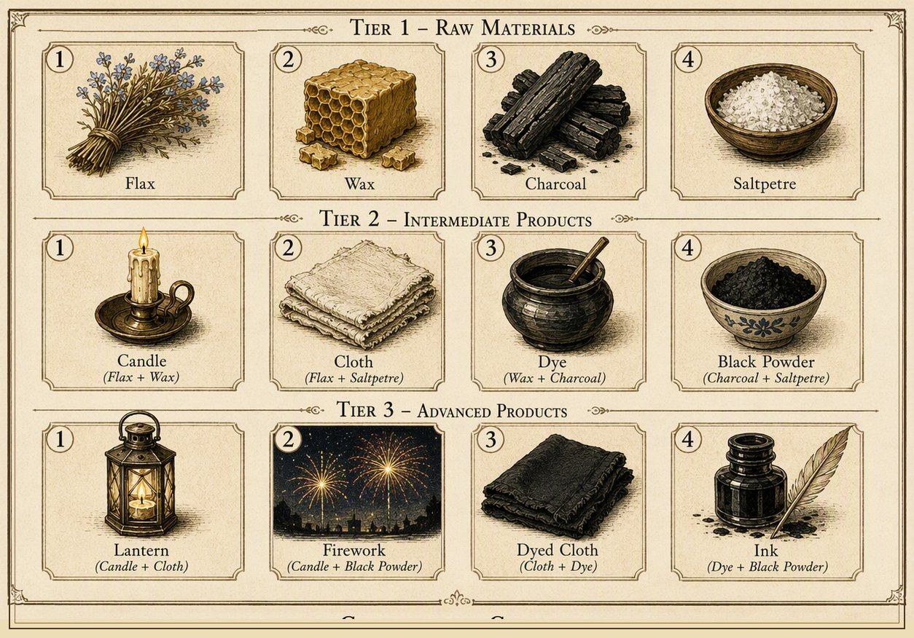
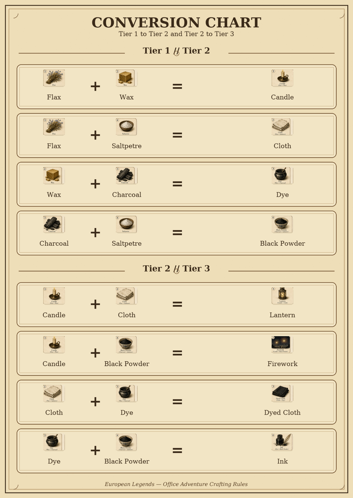

# European Legends — Office Adventure Game: Balance & Design Analysis

**Reviewed document:** *European Legends Office Adventure Game*, v. 16 August 2026
**Event:** EIB Group charity game, 17 September 2026, up to 8 guilds × 5 players
**Revision 2** — substantially rewritten after an independent review. See [§0](#s0) for what changed and why.

**Reference figures from the source document:**

---

## 0. What changed in this revision

An independent reviewer found three reasoning errors in the first draft, one of which invalidated a central recommendation, plus several important dynamics the first draft didn't examine at all. Rather than patch around them, this revision reworks the affected sections from scratch. In order of how much they change the conclusions:

1. **§2.1 was mathematically wrong.** The claim that a guild's starting hand *determines* which single Tier‑2 item it can craft is false — every starting hand supports **two** feasible recipes, not one. This breaks the original "deal starting kits to control room demand" recommendation. Corrected below, with a working replacement.
2. **§2.2's loan math overstated the penalty** in the typical case (guilds start with 10 coins, so most loans cover a shortfall of a few coins, not the full 15) and the "eliminated by round 2" line was an unsupported claim, now downgraded to an explicit open question for the simulation.
3. **The whole economic framing was too simple.** Sale prices (1/4/14/20 coins) are not the same as strategic value — a Tier‑2 item is also an admission ticket, and the reward mechanic (pay one Tier‑2, receive a *different* one) changes the real cost of room entry substantially. New §2.2–§2.4 below.
4. **A likely rules contradiction was missed** (generic quest scoring says even numbers only; several individual quests can score odd numbers) — now in §4, ranked near the top per the reviewer's suggestion.
5. **The "unmanaged scheduling is the default outcome" claim in §1 was asserted, not measured.** It's now backed by a toy Monte Carlo model (§7) instead of assertion, and the fixed-rotation recommendation now comes with a concrete, checked schedule instead of just "use a Latin square."
6. **A new central question is now the headline of the whole document**: does this game actually require cross-guild trading, given guilds can self-produce, craft, and exchange Tier‑2 items at rooms without ever dealing with another guild? See §2.5 — networking is a stated purpose of the event, so this is not a side issue.
7. Timing analysis (§3) now leads with the fact that the 100-minute schedule has **zero global slack**, which is a bigger operational risk than any single room's internal buffer.
8. §5 (Guildhall) reframed around throughput/protocol design rather than headcount.

---

## 1. Structural risk: room scheduling has no coordination mechanism

Each round, 4 activity rooms × 2 guild slots = exactly 8 slots — one per guild. Over 4 rounds that's 32 slots, exactly enough for all 8 guilds to visit all 4 rooms once each. Nothing in the rules guarantees that ideal matching happens on its own — guilds choose/race for rooms, constrained only by "two other guilds already paid their participation fee" locking a room.

**This is measured, not assumed** (see §7 for method): a toy model of guilds picking randomly among available, unvisited rooms each round — no negotiation, no GM steering, no visibility into what others are doing — completes all 4 rooms for **all 8 guilds in only 38% of games**, and **18% of individual guild-slots end up missing a room** even though the total capacity across the game exactly matches total demand. The real event has a GM, visible queues, and player negotiation, all of which should do better than this worst-case-ish model — but the model shows the risk is real and worth designing against, not merely a theoretical concern. An independent quick check by the reviewer using the same approach landed within 1 point of this figure (38% vs. 38.4%).

The system has **zero spare capacity**: one bad allocation early can leave a guild locked out of a room it still needs for the rest of the game, at a real cost (§7 also breaks down what that costs).

### Recommendation: a concrete, checked rotation — not just "use a Latin square"

A fixed, pre-printed 4-round rotation removes the coordination problem entirely, guaranteed by construction (not a probabilistic improvement). Splitting the 8 guilds into two groups of 4 (conveniently, the guilds already pair up by Tier‑1 specialty) and cycling each group through the four rooms independently gives exactly 2 guilds per room per round and exactly one visit to each room per guild:

| Round | Room 1 (Cloth) | Room 2 (Dye) | Room 3 (Black Powder) | Room 4 (Candle) |
|---|---|---|---|---|
| 1 | Lisbon, Bursa | Stockholm, Ghent | Gdansk, Venice | Prague, Vienna |
| 2 | Prague, Vienna | Lisbon, Bursa | Stockholm, Ghent | Gdansk, Venice |
| 3 | Gdansk, Venice | Prague, Vienna | Lisbon, Bursa | Stockholm, Ghent |
| 4 | Stockholm, Ghent | Gdansk, Venice | Prague, Vienna | Lisbon, Bursa |

(This is not technically a Latin square over 8 guilds — it's two independent order-4 cyclic rotations, one per group of 4, which is the simplest structure that satisfies the constraint. Worth calling it a "balanced rotation" rather than a Latin square when explaining it to helpers.)

This table is also the input the starting-hand fix in §2.1 needs — the two have to be designed together, or fixing one can force loans via the other.

---

## 2. Economic balance

### 2.1 Starting hands: two feasible recipes, not one — corrected

The four Tier‑1 materials form a 4-cycle: **Flax–Wax → Candle, Wax–Charcoal → Dye, Charcoal–Saltpetre → Black Powder, Saltpetre–Flax → Cloth.** Diagonal pairs (Flax+Charcoal, Wax+Saltpetre) don't convert to anything.

Each guild starts with 3 random *different* Tier‑1 items — missing exactly one of the four types. **The first draft of this analysis claimed the missing type determines which single Tier‑2 item the guild can craft. That's wrong.** Removing one node from a 4-cycle leaves a 3-node path with a shared middle ("hub") item — which means the guild can only *manufacture* one card (it holds only one unit of the hub item), but it has a **choice of two** possible recipes, both using that hub item:

| Missing material | Starting materials | Tier‑2 choices (pick one) |
|---|---|---|
| Flax | Wax, Charcoal, Saltpetre | Dye **or** Black Powder |
| Wax | Flax, Charcoal, Saltpetre | Black Powder **or** Cloth |
| Charcoal | Flax, Wax, Saltpetre | Candle **or** Cloth |
| Saltpetre | Flax, Wax, Charcoal | Candle **or** Dye |

This matters because it **invalidates the original recommendation** to deal starting kits so exactly 2 guilds are missing each Tier‑1 type. That controls the *aggregate opportunity set* (which items exist to be crafted, symmetrically), but it does not control *what guilds actually choose to craft* — four guilds could all independently choose Candle from four different starting hands and none choose the other options. Controlled dealing produces **symmetrical opportunity, not balanced demand.**

**The actual deterministic fix** is to design starting hands *against the room rotation* (§1), not against aggregate symmetry: guarantee each guild's starting hand supports crafting the specific Tier‑2 item its **assigned first room** requires. Since each of the four possible "missing" choices supports exactly two Tier‑2 outputs, and each Tier‑2 output is supported by exactly two possible "missing" choices, this is always achievable — e.g. for the rotation in §1, Round‑1 assignments require:

| Guild | Round‑1 room needs | Guild's hand must **not** be missing | So the hand should be missing |
|---|---|---|---|
| Lisbon, Bursa | Cloth (Flax+Saltpetre) | Flax, Saltpetre | Wax or Charcoal |
| Stockholm, Ghent | Dye (Wax+Charcoal) | Wax, Charcoal | Flax or Saltpetre |
| Gdansk, Venice | Black Powder (Charcoal+Saltpetre) | Charcoal, Saltpetre | Flax or Wax |
| Prague, Vienna | Candle (Flax+Wax) | Flax, Wax | Charcoal or Saltpetre |

This guarantees every guild can pay its Round‑1 room fee from its opening hand — removing the "10 coins isn't enough for the 15-coin fallback" problem entirely for round 1, without touching randomness in a way players would notice (they still don't know in advance which two items they'll get, only which one they won't).

### 2.2 Tier‑2 items are admission rights, not 4-coin commodities

The original draft compared items purely by end-game sale price (Tier 1 = 1, Tier 2 = 4, Tier 3 = 14) and concluded crafting up the chain is "strictly worth doing." **That conflates sale price with strategic value, and it's the biggest conceptual gap in the first draft.**

A Tier‑2 item is also the entry ticket to a room that otherwise costs **15 coins** in cash. Its *shadow value* right before a guild's next required room visit is much closer to "the coins it saves" than to its 4-coin liquidation price. Concretely: a guild holding two Tier‑2 cards can either (A) craft them into a Tier‑3 card — nominal gain 8→14, +6 coins — or (B) hold one back to pay for an unvisited room's entry, avoiding a 15-coin cash cost. Depending on which rooms are still unvisited, (B) can be worth far more than (A). **Crafting up the chain before a guild's room obligations are satisfied can be a mistake, not a free win.**

The general point: this game has **time-dependent, endogenous item values**, not a fixed price ladder — value depends on the round, which rooms remain unvisited, future recipe needs, and how many coins the guild has on hand as a substitute. That's a more interesting design than a flat price sheet, and it's something the simulation needs to model at the level of individual item identity, not aggregate item counts (see §2.5, §8).

### 2.3 The room reward loop makes item-based and coin-based admission very unequal

Room entry isn't just "spend one Tier‑2 item." After completing a room, the guild **exchanges** it: *"guilds choose a new tier 2 item, different than the one they paid to participate."* So paying with an item is closer to a swap than a cost:

- **Item admission:** surrender a card worth 4 (liquidation) → receive a different card worth 4. Net asset loss ≈ 0, plus the guild earns quest coins and possibly the 5-coin room-win bonus.
- **Coin admission:** surrender 15 real coins → (apparently) receive the same reward card. Net loss ≈ 15 coins for the same reward and quest income.

That's a large asymmetry, and it means **holding the correct Tier‑2 prerequisite going into a room may be one of the strongest strategic assets in the game** — a much bigger deal than the original draft's framing of items as interchangeable "4-coin" units.

One open question this surfaces: **does a guild that pays the 15-coin fallback also receive a reward Tier‑2 card afterward?** The rule text ("different than the one they paid") reads as if it assumes item-based payment. If coin-payers get no reward card, the 15-coin path is even worse than the comparison above; if they do, it's exactly as described. This should be added to §4's ambiguity list and resolved before simulating.

### 2.4 Loans: the shortfall is usually much smaller than 15 coins — corrected

The original draft assumed a "round‑1 loan of 15 coins costs 30 at the end," implying every loan is a 15-coin loan. The rule text says the GM lends **the missing amount**, not the full fee. Guilds start with 10 coins, so a guild needing the 15-coin fallback and still holding its starting coins needs a loan of only **5**, repaid at double = **10** at game end — not 30. A 15-coin loan only happens if a guild has already spent down to zero coins by the time it needs the fallback, which is a real possibility later in the game but not the round‑1 default case.

The stronger claim in the first draft — *"a guild can be mathematically eliminated from contention by round 2 without any player mistake"* — was asserted without supporting math and should be treated as an open hypothesis, not a finding. The honest version: **loans can create negative feedback (weaker guilds risk taking on more debt, which weakens them further), but how severe that feedback loop actually is depends on quantities the written rules don't fully pin down (whether coin-payers get reward items, how often the 15-coin path is actually needed) and needs to come from the simulation, not from reading the rules alone.**

### 2.5 The central open question: does this economy actually require trading?

This is arguably the most important thing the first draft missed, and it cuts against one of its own "what's working well" claims (that the recipe cycle "forces genuine cross-guild trading").

Consider a guild that never trades with anyone: it crafts one Tier‑2 item from its starting hand (§2.1), pays into its Round‑1 room, and receives a *different* Tier‑2 item as a reward (§2.3). If that reward happens to be the item needed for an unvisited room, it can pay into that room next, receive yet another new Tier‑2 item, and so on — potentially chaining through all four rooms using only its own starting hand and the reward mechanic, without ever needing another guild's items. Guilds also self-produce increasing quantities of their own Tier‑1 specialty each round, giving them raw material for further crafting entirely in-house.

This isn't guaranteed to work every time, though, and the reason why is itself an interesting design detail: **each room seats 2 guilds sharing one reward pool of 3 cards.** The winner picks first. If both guilds in a room happen to want the same next-room item, the loser is forced to take something else — which is exactly the moment trading (or a fallback coin payment) becomes necessary. So scarcity, and therefore the incentive to trade, may be concentrated entirely in these two-guild reward collisions, rather than being a constant pressure created by the recipe graph itself as originally claimed.

Given that networking is an explicit stated purpose of the event, **whether the current rules create enough scarcity to make trading necessary — or whether a self-sufficient "solo chaining" strategy can win without ever talking to another guild — should be one of the first things the simulation measures**, ahead of any tuning of loan interest or Tier‑3 prices. The "recipe graph forces trading" claim is removed from §6 below pending that result.

### 2.6 Guild special items and unique quests are marked "in elaboration"

The 20-coin guild-special-item bonus and each guild's unique 15–20 coin quest aren't defined yet in this draft. They're relevant to §2.4's catch-up question and to guild identity — worth finishing before final simulation runs, since guild-specific asymmetries will shift the results.

---

## 3. Timing

### 3.1 The schedule has zero global slack — the bigger risk

Opening (10) + 4×activities (40) + 3×trading breaks (30) + final trading (10) + final briefing (10) = **100 minutes exactly**, with no built-in contingency anywhere for a briefing running long, a puzzle needing a reset, a scoring dispute, AV trouble, or simple congestion. For a live 40-person event, this is a bigger operational risk than any single room's internal timing margin. **Recommend building in 5–10 minutes of recoverable slack** — e.g. a deliberately loose opening briefing that can be trimmed live, or a short buffer folded into the final trading window — rather than treating 100 minutes as a hard, page a fully-packed schedule.

### 3.2 Per-room timing (secondary, but still worth checking)

Each room's two sub-quests run in parallel (guild splits in half), bounded by the longer one:

| Room | Longer sub-quest | Bound | Buffer in 10 min |
|---|---|---|---|
| 1 – Cloth Room | Cartographer's Workshop (strict) | 7 min | ~3 min |
| 2 – Dye Room | Hall of Languages (est.) | ~6 min | ~4 min |
| 3 – Black Powder Room | Architect's Challenge (strict) | 7 min | ~3 min |
| 4 – Candle Room | Scribe's Observation | 7 min | ~3 min |

These buffers are workable on paper but, per §3.1, there's no cushion elsewhere in the schedule to absorb it if one room runs over.

---

## 4. Rules ambiguities and gaps worth resolving before the simulation

Reordered from the first draft — the scoring contradiction is promoted to the top since it directly affects simulation parameters, not just clarity.

1. **Quest scoring scale contradicts itself.** The generic rule states *"Each quest scores 0, 2, 4, 6, 8 or 10 coins"* (even numbers only), but several individual quests explicitly allow odd totals: the "1 coin per correct answer" quests (European Music Hall, Art Gallery, Hall of Languages) can score any value 0–10, and the Cartographer's Workshop and Architect's Challenge scoring tables both include odd values (3, 5, 7). Only the Locksmith's Secret table is actually consistent with the generic even-only rule. This needs a resolution before the simulation can model expected quest income or room-winner-bonus frequency correctly.
2. **Does the 15-coin fallback also grant a reward Tier‑2 item afterward?** (§2.3) — changes the relative cost of the two admission paths substantially.
3. **Room assignment mechanism** — is it free choice/racing (as implied by "two other guilds already paid"), GM-directed, or (per the §1 recommendation) a fixed rotation?
4. **Where/when can peer-to-peer trading happen?** Crafting is explicitly Guildhall-only; general trades aren't location-restricted in the text — mid-activity-room, or only during trading breaks?
5. **Common Quest 3B (Hall of Legends)** doesn't state its clue count, unlike the other four "identify 10 things" quests.
6. **Fallback for a guild that never completes all 4 rooms** — any end-game recourse, or is that quest income simply lost? (Now known to be a real risk at ~18% of guild-slots under unmanaged scheduling — §7.)

---

## 5. Operational risk: the Guildhall needs a designed, throughput-tested protocol

Conversions, quest-fee payments, and loans all funnel through the Guildhall/GM. During a single 10-minute trading break it may need to simultaneously handle: Tier‑1 production for up to 8 guilds, Tier‑1→Tier‑2 and Tier‑2→Tier‑3 crafting, room-fee payment and booking for the next round, loan issuance, disputes, and player questions — while guilds are also trying to negotiate trades with each other in the same window. Peer-to-peer trades look self-administered (no GM sign-off implied by the text), which helps, but everything else is a real queue.

**"Add 2–3 more helpers" is a reasonable start but isn't the actual fix** — the real question is throughput, not headcount. Recommend designing an explicit transaction protocol (e.g. a marked self-service swap table for straightforward 2-cards-for-1 conversions, GM only for loans/disputes) and, if possible, timing it in a rehearsal: seconds per transaction type, transactions needed per guild per round, and the probability a guild fails to complete its intended actions in 10 minutes. That number should feed directly into whether more staff, a simpler protocol, or both are needed.

---

## 6. What's working well

- The tier price ladder (§2.2) makes crafting a genuinely interesting decision rather than an obviously-always-correct one, once you account for shadow value — that's better design than "crafting is always good," not worse.
- Per-room quest timing comfortably fits the 10-minute slots when run in parallel (§3.2).
- The room-level win bonus / tie handling (5 coins, or 2/2 on a tie) is simple and won't produce weird edge cases.
- Charity ticket design (fixed €20 donation, no refund) is clean and doesn't interact with the in-game economy.
- The two-guilds-per-room reward pool (§2.5) is a subtle, probably-intentional scarcity mechanism worth preserving — it may be doing more balancing work than the recipe graph itself.

*(Removed from this list: "the recipe graph forces cross-guild trading" — see §2.5, this is now an open question rather than a settled positive.)*

---

## 7. Appendix: toy scheduling model (supporting §1, not the full simulation)

**Method:** 8 guilds, 4 rooms, 4 rounds, capacity 2 guilds/room/round. Each round, guilds are processed in random order; each guild picks uniformly at random among rooms it hasn't visited yet that still have a free slot. No negotiation, no visibility into other guilds' plans, no GM steering — deliberately the simplest model of fully unmanaged self-scheduling, used only to check whether the concern is measurable. 200,000 simulated games, seeded for reproducibility. Code: [`simulation/toy_scheduling_model.py`](../simulation/toy_scheduling_model.py).

**Results:**

| Metric | Result |
|---|---|
| Games where all 8 guilds visit all 4 rooms | 38.2% |
| Individual guild-slots that complete all 4 rooms | 82.3% |
| Guild-slots missing exactly 1 room | 17.6% |
| Guild-slots missing 2+ rooms | ~0% |

An independent check by the reviewer using the same approach landed at 38.4% — consistent to within simulation noise.

**Reading these numbers:** this is a lower-bound-ish worst case (real players negotiate and can see the room), not a prediction of the actual event. It exists only to convert "this is a real risk" from an assertion into a checked claim, and to give the §1 fixed-rotation recommendation a concrete baseline to compare against (the fixed rotation gets this to 100% by construction — no simulation needed for that half).

---

## 8. Simulation plan (methodology, before any code for the full model)

Per the independent review: a simulation isn't useful design evidence unless the questions it needs to answer, and the variants it needs to compare, are specified before it's built. Proposed scope for the next phase:

**Core questions to measure:**
1. Probability every guild completes all 4 rooms, under realistic (not worst-case) scheduling behavior.
2. Distribution of final scores across guilds — how much of the spread is starting-hand luck vs. room-assignment luck vs. play quality.
3. Number of loans per guild and resulting debt distribution at game end.
4. Number of inter-guild trades that actually occur, and the fraction of guilds that could plausibly finish competitively without trading at all (§2.5 — the central question).
5. Tier‑1/Tier‑2/Tier‑3 inventory levels over time, per guild.
6. Shadow value of each Tier‑2 item type by round (§2.2) — i.e., what it's actually worth to a guild holding it at a given point, not its sale price.
7. Marginal expected-score value of a single room visit, including its reward card and downstream effects — not just its quest coins (corrects §7's "~20–25 coins lost" framing from the first draft, which only counted quest income).
8. Win-rate differences by guild/specialty, once §2.6's guild-specific content is finalized.
9. Sensitivity to player skill/behavior — rational optimizers vs. casual play — since this is a mixed-skill charity event, not a competitive tournament.

**Design variants to compare against the current ruleset:**
- Fixed room rotation (§1) vs. free-choice scheduling.
- Coordinated starting hands (§2.1) vs. purely random.
- Current loan interest (double) vs. capped/first-loan-only interest.
- Current Tier‑3 sale values vs. alternatives.
- Mandatory vs. optional trading windows (to directly probe §2.5).

Building the full agent-based model against this plan is the next step once §4's ambiguities are resolved (particularly the scoring-scale contradiction and the coin-payment reward-card question, both of which change simulation parameters directly).

---

## 9. Priority order for fixes

Revised to reflect the corrections above:

1. **Correct understanding of starting hands** (§2.1) before designing any kit-dealing rule — the two-recipe choice changes what "controlling" the starting deal can and can't achieve.
2. **Model Tier‑2 items as admission rights, not 4-coin commodities** (§2.2–§2.3) — this changes the crafting economics substantially and should shape how the simulation values inventory.
3. **Determine whether trading is actually necessary** (§2.5) — directly relevant to the event's stated networking purpose, and should be one of the first simulation outputs, not an afterthought.
4. **Resolve the quest-scoring contradiction** (§4.1) — needed before quest income can be modeled at all.
5. **Clarify the loan rule and the coin-payment reward question** (§2.4, §4.2) before touching the interest rate.
6. **Implement the fixed room rotation**, coordinated with starting hands (§1, §2.1) — the concrete table above is ready to use.
7. **Add global schedule slack** (§3.1) — the 100-minute program currently has none.
8. **Design and throughput-test the Guildhall transaction protocol** (§5) rather than just adding volunteers.
9. **Finalize guild special items and unique quests** (§2.6) so they can be included in the simulation.
10. **Build the full simulation** against the plan in §8, only once 1–9 above are settled.

---

*Next: build the agent-based simulation described in §8.*
